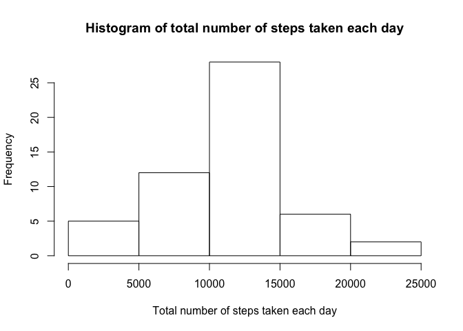
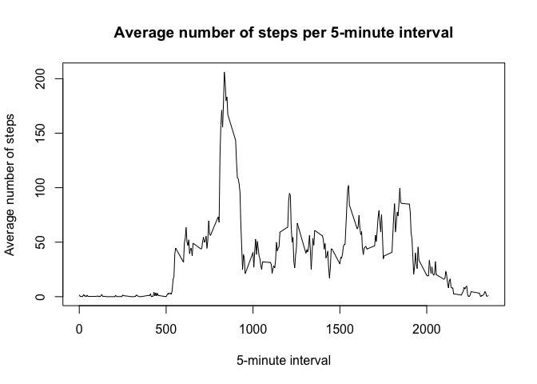
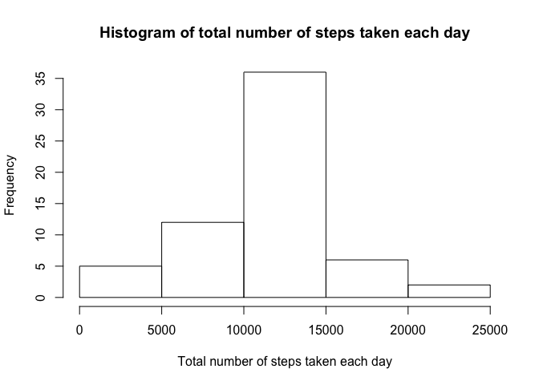
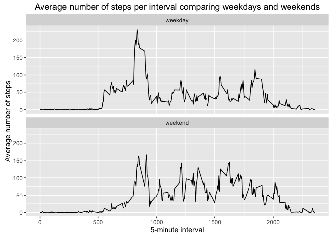

# Reproducible Research: Peer Assessment 1

## Loading and preprocessing the data

Show any code that is needed to:  

1. Load the data (i.e. read.csv())  
2. Process/transform the data (if necessary) into a format suitable for your analysis  


```r
library(dplyr)
```

```
## 
## Attaching package: 'dplyr'
```

```
## The following objects are masked from 'package:stats':
## 
##     filter, lag
```

```
## The following objects are masked from 'package:base':
## 
##     intersect, setdiff, setequal, union
```

```r
library(ggplot2)
```

```
## Want to understand how all the pieces fit together? Buy the
## ggplot2 book: http://ggplot2.org/book/
```

```r
unzip("activity.zip")
data <- read.csv("activity.csv")
data.na.omit <- na.omit(data)
```

## What is mean total number of steps taken per day?

For this part of the assignment, you can ignore the missing values in the dataset.

1. Calculate the total number of steps taken per day
2. If you do not understand the difference between a histogram and a barplot, research the difference between them. Make a histogram of the total number of steps taken each day
3. Calculate and report the mean and median of the total number of steps taken per day


```r
# Calculate the total number of steps taken per day
data.by.date <- group_by(data.na.omit, date)
data.total.steps.by.date <- summarise(data.by.date, total.steps = sum(steps))
data.total.steps.by.date
```

```
## Source: local data frame [53 x 2]
## 
##          date total.steps
##        (fctr)       (int)
## 1  2012-10-02         126
## 2  2012-10-03       11352
## 3  2012-10-04       12116
## 4  2012-10-05       13294
## 5  2012-10-06       15420
## 6  2012-10-07       11015
## 7  2012-10-09       12811
## 8  2012-10-10        9900
## 9  2012-10-11       10304
## 10 2012-10-12       17382
## ..        ...         ...
```

```r
# Make a histogram of the total number of steps taken each day
hist(data.total.steps.by.date$total.steps, main = "Histogram of total number of steps taken each day", xlab = "Total number of steps taken each day")
```

<!-- -->

```r
# Calculate the mean of the total number of steps taken per day
mean(data.total.steps.by.date$total.steps)
```

```
## [1] 10766.19
```

```r
# Calculate the median of the total number of steps taken per day
median(data.total.steps.by.date$total.steps)
```

```
## [1] 10765
```

## What is the average daily activity pattern?

1. Make a time series plot (i.e. type = "l") of the 5-minute interval (x-axis) and the average number of steps taken, averaged across all days (y-axis)
2. Which 5-minute interval, on average across all the days in the dataset, contains the maximum number of steps?


```r
# Calculate the average number of steps taken per interval
data.steps.by.interval <- aggregate(steps ~ interval, data.na.omit, mean)

# Plot the data
plot(data.steps.by.interval$interval, data.steps.by.interval$steps, type = "l", main = "Average number of steps per 5-minute interval", xlab = "5-minute interval", ylab = "Average number of steps")
```

<!-- -->

```r
# Calculate which interval contains the max steps
data.max.steps <- which.max(data.steps.by.interval$steps)
data.steps.by.interval[data.max.steps,]$interval
```

```
## [1] 835
```

## Imputing missing values

Note that there are a number of days/intervals where there are missing values (coded as NA). The presence of missing days may introduce bias into some calculations or summaries of the data.

1. Calculate and report the total number of missing values in the dataset (i.e. the total number of rows with NAs)
2. Devise a strategy for filling in all of the missing values in the dataset. The strategy does not need to be sophisticated. For example, you could use the mean/median for that day, or the mean for that 5-minute interval, etc.
3. Create a new dataset that is equal to the original dataset but with the missing data filled in.
4. Make a histogram of the total number of steps taken each day and calculate and report the mean and median total number of steps taken per day. Do these values differ from the estimates from the first part of the assignment? What is the impact of imputing missing data on the estimates of the total daily number of steps?


```r
# Calculate total number of missing values
sum(is.na(data))
```

```
## [1] 2304
```

```r
# Use interval mean to fill in missing values
data.imputed <- data
for (i in 1:nrow(data.imputed)) {
  if (is.na(data.imputed$steps[i])) {
    interval <- data.imputed$interval[i]
    steps <- data.steps.by.interval[data.steps.by.interval$interval == interval,]
    data.imputed$steps[i] <- steps$steps
  }
}

# Calculate the total number of steps taken per day
data.imputed.total.steps.by.date <- aggregate(steps ~ date, data.imputed, sum)
data.imputed.total.steps.by.date
```

```
##          date    steps
## 1  2012-10-01 10766.19
## 2  2012-10-02   126.00
## 3  2012-10-03 11352.00
## 4  2012-10-04 12116.00
## 5  2012-10-05 13294.00
## 6  2012-10-06 15420.00
## 7  2012-10-07 11015.00
## 8  2012-10-08 10766.19
## 9  2012-10-09 12811.00
## 10 2012-10-10  9900.00
## 11 2012-10-11 10304.00
## 12 2012-10-12 17382.00
## 13 2012-10-13 12426.00
## 14 2012-10-14 15098.00
## 15 2012-10-15 10139.00
## 16 2012-10-16 15084.00
## 17 2012-10-17 13452.00
## 18 2012-10-18 10056.00
## 19 2012-10-19 11829.00
## 20 2012-10-20 10395.00
## 21 2012-10-21  8821.00
## 22 2012-10-22 13460.00
## 23 2012-10-23  8918.00
## 24 2012-10-24  8355.00
## 25 2012-10-25  2492.00
## 26 2012-10-26  6778.00
## 27 2012-10-27 10119.00
## 28 2012-10-28 11458.00
## 29 2012-10-29  5018.00
## 30 2012-10-30  9819.00
## 31 2012-10-31 15414.00
## 32 2012-11-01 10766.19
## 33 2012-11-02 10600.00
## 34 2012-11-03 10571.00
## 35 2012-11-04 10766.19
## 36 2012-11-05 10439.00
## 37 2012-11-06  8334.00
## 38 2012-11-07 12883.00
## 39 2012-11-08  3219.00
## 40 2012-11-09 10766.19
## 41 2012-11-10 10766.19
## 42 2012-11-11 12608.00
## 43 2012-11-12 10765.00
## 44 2012-11-13  7336.00
## 45 2012-11-14 10766.19
## 46 2012-11-15    41.00
## 47 2012-11-16  5441.00
## 48 2012-11-17 14339.00
## 49 2012-11-18 15110.00
## 50 2012-11-19  8841.00
## 51 2012-11-20  4472.00
## 52 2012-11-21 12787.00
## 53 2012-11-22 20427.00
## 54 2012-11-23 21194.00
## 55 2012-11-24 14478.00
## 56 2012-11-25 11834.00
## 57 2012-11-26 11162.00
## 58 2012-11-27 13646.00
## 59 2012-11-28 10183.00
## 60 2012-11-29  7047.00
## 61 2012-11-30 10766.19
```

```r
# Make a histogram of the total number of steps taken each day
hist(data.imputed.total.steps.by.date$steps, main="Histogram of total number of steps taken each day", xlab = "Total number of steps taken each day")
```

<!-- -->

```r
# Calculate the mean and median of the imputed data
mean(data.imputed.total.steps.by.date$steps)
```

```
## [1] 10766.19
```

```r
median(data.imputed.total.steps.by.date$steps)
```

```
## [1] 10766.19
```

```r
# Compare with the mean and median of the original data
mean(data.total.steps.by.date$total)
```

```
## [1] 10766.19
```

```r
median(data.total.steps.by.date$total)
```

```
## [1] 10765
```

## Are there differences in activity patterns between weekdays and weekends?

For this part the weekdays() function may be of some help here. Use the dataset with the filled-in missing values for this part.

1. Create a new factor variable in the dataset with two levels – "weekday" and "weekend" indicating whether a given date is a weekday or weekend day.
2. Make a panel plot containing a time series plot (i.e. type = "l") of the 5-minute interval (x-axis) and the average number of steps taken, averaged across all weekday days or weekend days (y-axis). See the README file in the GitHub repository to see an example of what this plot should look like using simulated data.


```r
# Create new day.type factor variable specifying if day is "weekday" or "weekend"
data.imputed['day.type'] <- weekdays(as.Date(data.imputed$date))
data.imputed$day.type[data.imputed$day.type  %in% c('Saturday','Sunday') ] <- "weekend"
data.imputed$day.type[data.imputed$day.type != "weekend"] <- "weekday"
data.imputed$day.type <- as.factor(data.imputed$day.type)

# Calculate the average number of steps taken per interval
data.imputed.steps.by.interval <- aggregate(steps ~ interval + day.type, data.imputed, mean)

# Plot the data
qplot(interval, steps, data = data.imputed.steps.by.interval, geom=c("line"), xlab = "5-minute interval", ylab = "Average number of steps", main = "Average number of steps per interval comparing weekdays and weekends") + facet_wrap(~ day.type, ncol = 1)
```

<!-- -->

